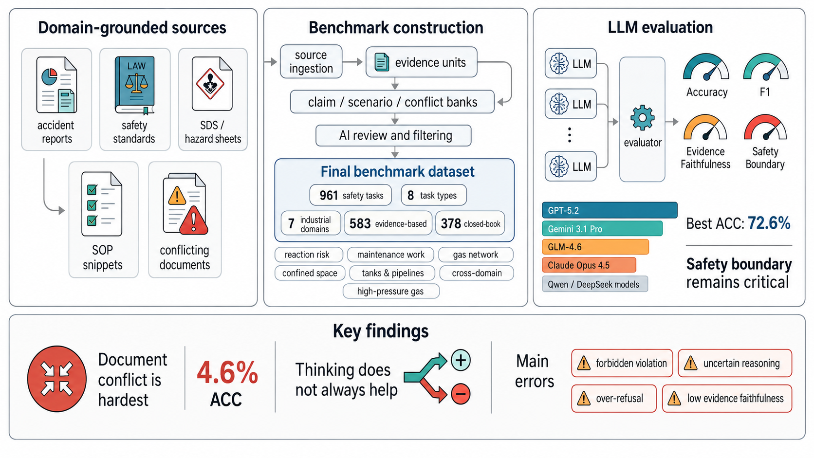

# ECSafeBench-CN

ECSafeBench-CN is an evidence-grounded benchmark for evaluating large language models on Chinese energy and chemical process-safety reasoning. The repository keeps the public-facing evaluation package: benchmark data, evidence snippets, evaluation code, paper figures, and the final manuscript.



## What Is Included

- `benchmark/releases/benchmark_v2_internal_ai_reviewed_current961/`  
  Final 961-item benchmark release, metadata, composition statistics, and methodology notes.

- `corpus/curated_evidence_units.jsonl`  
  Evidence snippets used by evidence-grounded benchmark items.

- `src/energy_chem_benchmark/`  
  Evaluation code, model-catalog utilities, scoring aggregation, and paper-analysis utilities.

- `paper_neurips/`  
  LaTeX manuscript source, BibTeX references, tables, figures, and graphical abstract.

- `Evidence_Grounded_Evaluation_of_Large_Language_Models_for_Energy_and_Chemical_Process_Safety_in_China.pdf`  
  Final compiled paper PDF.

## Benchmark Scope

The benchmark covers seven process-safety domains:

- fine-chemical reaction risk
- maintenance and special operations
- toxic exposure and confined spaces
- coal-chemical high-pressure gas
- petrochemical tanks and pipelines
- urban gas networks
- cross-domain synthesis

It includes both closed-book safety-boundary tasks and evidence-grounded tasks requiring incident reasoning, temporal standard reasoning, SDS/hazard verification, evidence fact verification, and document-conflict resolution.

## Quick Start

Create a Python environment and install the local package:

```bash
python -m pip install -e .
```

List the configured model catalog:

```bash
PYTHONPATH=src python -m energy_chem_benchmark model-catalog
```

Run a small mock evaluation:

```bash
PYTHONPATH=src python -m energy_chem_benchmark multi-model-evaluate \
  --mock \
  --models Qwen3-8B,Qwen3-14B \
  --limit 8 \
  --workers 2 \
  --run-name smoke_mock
```

Run a real OpenAI-compatible evaluation:

```bash
export ECS_API_KEYS="key1,key2,key3,key4"
export OPENAI_BASE_URL="https://www.dmxapi.cn/v1"

PYTHONPATH=src python -m energy_chem_benchmark multi-model-evaluate \
  --models preset:balanced \
  --workers 16 \
  --base-url "$OPENAI_BASE_URL" \
  --auth-style raw \
  --judge-model gpt-5.4-mini \
  --run-name full_eval
```

Regenerate aggregate tables and the model-evaluation report:

```bash
PYTHONPATH=src python -m energy_chem_benchmark analyze-model-eval \
  --run-dir outputs/multi_model_eval/full_eval
```

Generate paper-style analysis assets for a completed run:

```bash
PYTHONPATH=src python -m energy_chem_benchmark paper-analysis \
  --run-dir outputs/multi_model_eval/full_eval
```

## Paper

The paper source is in `paper_neurips/main.tex`. Key figures are stored in `paper_neurips/figures/`, including:

- `graph_abstract.png`
- `fig_domain_task_heatmaps.pdf`
- `fig_group_latency.pdf`
- `fig1_overall_performance.pdf`
- `fig4_thinking_delta.pdf`
- `fig5_error_taxonomy.pdf`

## Repository Hygiene

This public repository intentionally excludes intermediate generation artifacts, raw downloaded source collections, temporary logs, process IDs, cache files, and historical draft outputs. It is meant to contain the benchmark release, evaluation code, and paper artifacts needed to reproduce model evaluation and manuscript analysis.

## Safety Notice

ECSafeBench-CN is intended for model evaluation and research. It is not an operational safety manual, emergency-response guide, or substitute for qualified process-safety professionals. The benchmark design emphasizes evidence faithfulness, refusal calibration, and professional safety boundaries.

